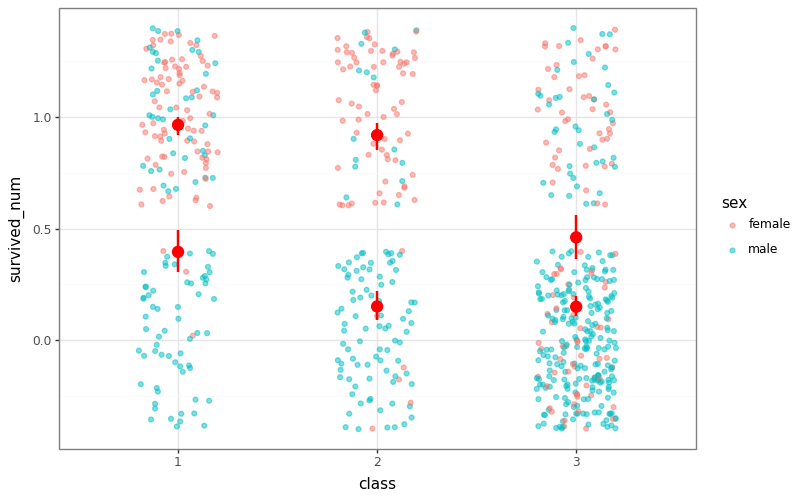

# py-flexplot

A Python port of Dustin Fife's [`flexplot`](https://github.com/dustinfife/flexplot) and related R packages (`fifer`, `flexplavaan`, etc.). 

`py-flexplot` provides intelligent data visualization using a formula-based syntax, similar to the original R implementation but powered by `plotnine` for a consistent "grammar of graphics" look and feel in Python.



## Included R Packages
- **flexplot**: Intelligent multivariate graphics via formulas.
- **fifer/fifer2**: Biostatistical toolbox for data cleanup and analysis.
- **flexplavaan**: Visualizing latent variable models (SEM).
- **flex_nn**: Neural network visualization (In progress).
- **flexifiers**: Data transformation utilities (In progress).

## Installation

```bash
pip install py-flexplot
```

## Quick Start

```python
import pandas as pd
from pyflexplot import flexplot, visualize
import statsmodels.formula.api as smf

# Load data
df = pd.read_csv("data.csv")

# 1. Formula-based visualization
# y ~ x | z (y by x, faceted by z)
p = flexplot("y ~ x | z", data=df)
p.draw()

# 2. Model visualization
model = smf.ols("y ~ x", data=df).fit()
p_viz = visualize(model, data=df)
p_viz.draw()
```

## Features
- **Formula Syntax**: Uses `y ~ x + z | a` to automatically determine plot types.
- **Model Visualization**: Directly `visualize(model)` to see predicted vs actuals.
- **Model Comparison**: Use `compare_fits(formula, data, m1, m2)` to see performance side-by-side.
- **Biostats Utilities**: Ported functions from `fifer` for common statistical tasks.

## License
MIT
