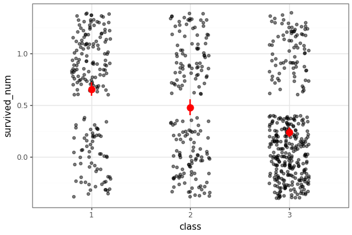
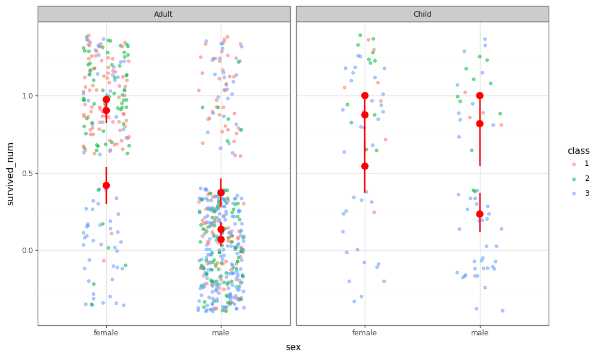

# Case Study: Titanic Survival Analysis

This example demonstrates how `py-flexplot` automatically chooses the best visualization based on your statistical formula.

## 1. Univariate Analysis: Survival by Class

We want to see the survival rate across the three passenger classes. `flexplot` detects a numeric outcome and a categorical predictor, so it creates a jittered dot plot with bootstrapped means and 95% confidence intervals.

**Formula**: `survived_num ~ class`

*The plot clearly shows a significant drop in survival probability as we move from 1st class to 3rd class.*

---

## 2. Bivariate Analysis: Class and Gender

Adding a second predictor (`sex`) maps it to color and grouping automatically.

**Formula**: `survived_num ~ class + sex`

*We observe that women had higher survival rates across all classes, but the disparity between classes was far more lethal for men.*

---

## 3. Multivariate Analysis: Faceting by Age

Finally, we use the "given" syntax (`|`) to facet the analysis by age group (Child vs. Adult).

**Formula**: `survived_num ~ sex + class | age`

*The faceted view uncovers a critical interaction: children in 1st and 2nd class were prioritized and saved at near-equal rates, while 3rd-class children faced survival rates much closer to those of adults.*

---

## Summary

In just three lines of code, `py-flexplot` handled:
1. **Intelligent Geom Selection**: Switching from dots to colored groups to facets.
2. **Statistical Aggregation**: Bootstrapping means and CIs on the fly.
3. **Clean Presentation**: Maintaining a consistent, publication-ready look via `plotnine`.
